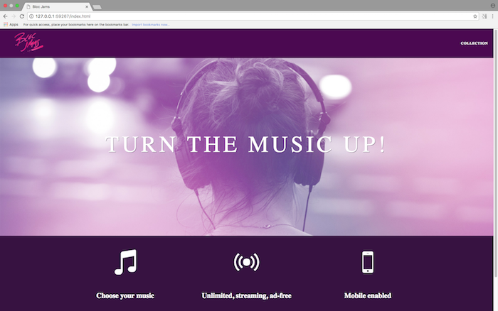
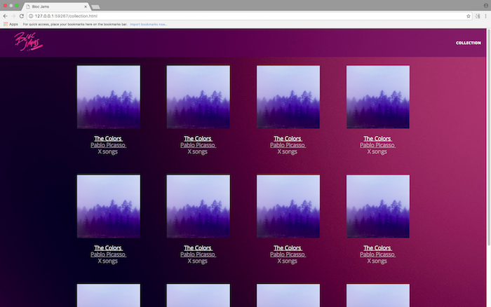
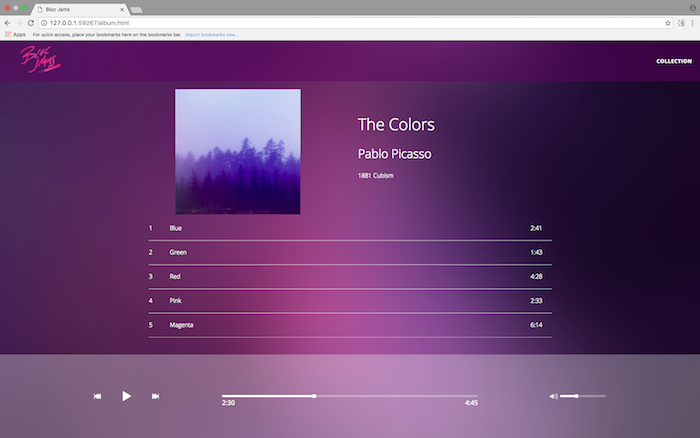

#Bloc Jams
Bloc Jams is a digital music player like Spotify, created using HTML/CSS, and JavaScript (vanilla and jQuery). 

 

##Project Summary
We began this project with HTML/CSS to provide the basic structure, styles, responsiveness, and to create the pages and views needed. Next, we utilized JavaScript for animation and DOM Scripting for events and functionality. We used loops to populate our albums in Collections and song rows in Album. We considered the states of the play/pause button, when each would be used, and when we needed just the song number to display. We set up the click behavior, Mouseover and Mouseleave event listeners as well. Finally we introduced the player bar with its icons, including seekbar and volume. 

After this, we went back and refactored a large portion of our vanilla JS using jQuery and the Buzz library. We finalized the project with a fully functional player bar that synced with the song row functionality on the page and an adjustable seek bar and volume bar.

##Preview
Check out my [Netlify deploy](http://bloc-jams-travis-rodgers.netlify.com/) to see it in action.

##More Screenshots

 

